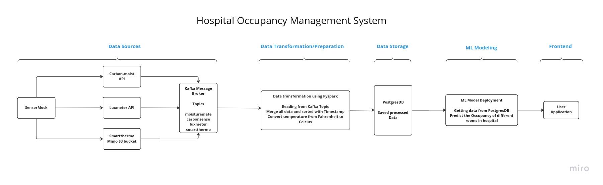

### Data Engineering Capstone Project Contributions

#### Introduction

In our team's Data Engineering Capstone project, I played a pivotal role in architecting and implementing a robust data pipeline to collect and process sensor data from various sources. My contributions were instrumental in ensuring smooth data flow, efficient processing, and insightful analysis.

#### Key Contributions

1. **Data Extraction and Integration**:
   - Extracted sensor data seamlessly from diverse sources including APIs and S3 storage.
   - Ensured data integrity and consistency during the extraction process, handling various data formats and structures with precision.

2. **Data Ingestion with Kafka**:
   - Implemented a reliable data ingestion mechanism using Kafka topic clusters.
   - Orchestrated the flow of data from source to destination, maintaining high throughput and low latency.

3. **Data Transformation with PySpark**:
   - Leveraged PySpark for performing intricate data transformations on the collected sensor data.
   - Developed scripts to cleanse, enrich, and standardize the data for further analysis.

4. **Frontend Development for Insights Visualization**:
   - Spearheaded the development of a user-friendly frontend interface using Bootstrap.
   - Designed intuitive visualizations to showcase predictions regarding room occupancy status derived from sensor data analysis.

#### Tech Stack

- **Programming Languages**: Python, SQL (PostgreSQL), HTML5, CSS3
- **Data Engineering**: ETL (Extract, Transform, Load), PySpark, Kafka
- **Operating Systems**: Linux
- **Tools & Applications**: Docker, Git, Jira
- **Frameworks and Cloud Services**: Flask, FastAPI, Bootstrap, MinIO, AWS

#### Achievements

- Successfully orchestrated the seamless integration of sensor data from multiple sources, enhancing the project's data acquisition capabilities.
- Optimized data processing pipelines, significantly reducing processing time and resource utilization, thereby improving overall efficiency.

#### Conclusion

My contributions to the Data Engineering Capstone project underscore my proficiency in designing and implementing scalable data pipelines, harnessing the power of distributed computing technologies, and delivering impactful data-driven insights. Through meticulous planning, execution, and innovation, I helped drive the project towards success, cementing my expertise in the field of data engineering.

---

# Team name : Data Monks

## Team Members

| Name | Rollnumber | Email|
| :------- | :------------: | ----------: |  
|  Muhammad Mudassir Raza |  2211-021-KHI-DEG |   mohammad.mudassir@xloopdigital.com |
|  Eraj Khan              |  2211-006-KHI-DEG |   eraj.khan@xloopdigital.com         |
|  Aniqa Masood           |  2211-003-KHI-DEG |   aniqa.masood@xloopdigital.com      |
|  Muhammad Osama         |  2211-022-KHI-DEG |   mohammad.osama@xloopdigital.com    |
|  Syed Saif Ali          |  2211-029-KHI-DEG |   syed.saif@xloopdigital.com         |
| Shahzaib Khan           | 2211-026-KHI-DEG  | shahzaib.khan@xloopdigital.com       |

## Project Vision

To automate the hospital rooms by getting predicting the data of occupation by IOT sensors and controlling the appliances of room automatically. 

A high level diagram from end-user perspective can be seen here.

## Contributions Conventions:
Here we will write conventions for our future use...

About requirements.txt and setup.py:
1) Create `requirements.txt` , create venv, activate it and install requirement.txt in it.
2) Create `setup.py` file , and run pip install . (pip will use setup.py to install your module) , this will 'create Capstone_project_deg_01.egg-info' and 'build' folders.

## How to Run:
1) Create a volume for MinIO by entering the command `docker volume create minio-data` in the terminal.
2) Execute the `start_app.sh` script to launch the entire application by running the command `./start_app.sh`.
3) Retrieve the IP address of the Postgres container by entering the command `docker inspect postgres_container | grep IPAddress` in the terminal.
4) Edit the `docker-compose.yml` file to update the IP address for the `transformation` and `ml_model_deploy` services.
5) Verify that the `transformation` service is sending and receiving data in the Postgres database by entering the command `docker exec -it postgres_container psql -U myuser mydb` in the terminal.
6) Check that the data has been received in the database table by visiting the frontend at `http://localhost:8000/data/api/endpoint`.
